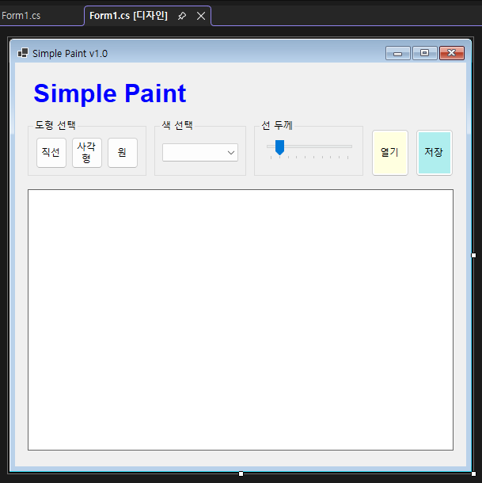
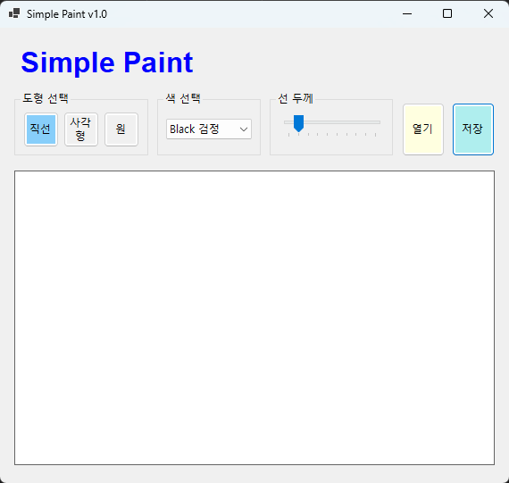
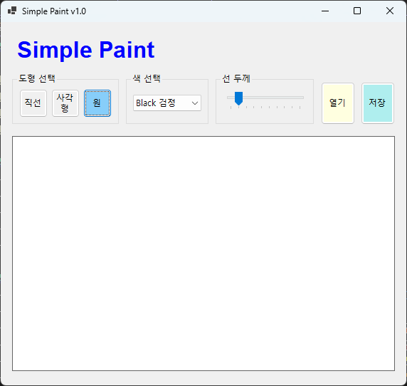
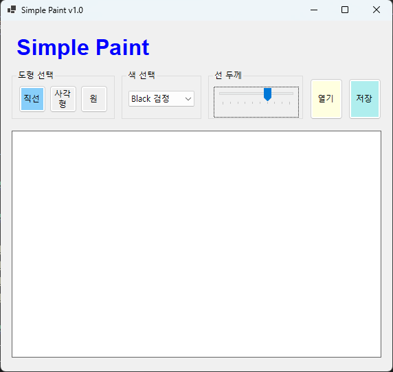
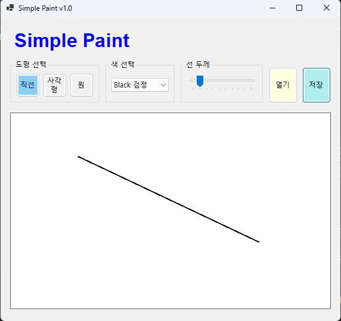
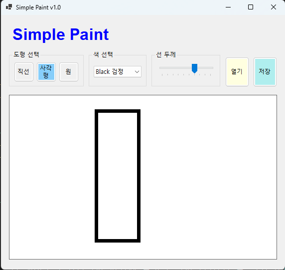
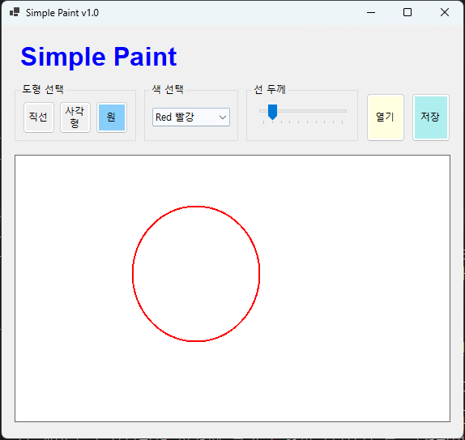
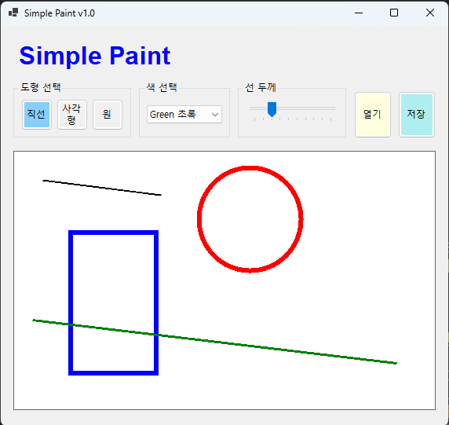

# (C# 코딩) 그림판(SimplePaint) 프로그램

## 목차
1. 개요
2. 과제 1
3. 과제 2
4. 과제 3
5. 과제 4

---
## 1. 개요

본 실습은 C# Windows Forms(.NET) 환경에서 간단한 그림판(Simple Paint) 프로그램을 구현하는 과제이다. Visual Studio 2026을 사용하여 기본적인 사용자 인터페이스 구성부터 시작하여, 도형 선택, 색상 선택, 선 굵기 설정 기능을 구현하고, 이후 단계적으로 마우스 드래그를 이용한 도형 그리기, 이미지 파일 저장, 외부 이미지 불러오기 기능까지 확장하는 것을 목표로 한다.

본 과제를 통해 이벤트 기반 프로그래밍 구조를 이해하고, Graphics 객체를 활용한 화면 출력 처리 방식과 이미지 데이터의 생성 및 저장 과정을 학습한다.

- 사용한 플랫폼
  : C#, .NET Windows Forms, Visual Studio 2026, GitHub
- 사용한 컨트롤
  : Label, GroupBox, Button, ComboBox, TrackBar, PictureBox, Panel
- 사용한 기술과 구현 기능
  : Windows Forms 기반 UI 설계
  : 마우스 이벤트(MouseDown, MouseMove, MouseUp)를 이용한 도형 그리기
  : Graphics 및 Bitmap 객체를 활용한 화면 출력 처리
  : SaveFileDialog / OpenFileDialog를 이용한 파일 입출력
  : 이미지 확대/축소 및 스크롤 처리
- 실습 중 구현한 주요 기능
  : 도형 선택 기능 (직선, 사각형, 원)
  : 색상 및 선 굵기 설정 기능
  : 마우스 드래그 기반 도형 그리기
  : 그림 파일 저장 기능 (PNG, JPG, BMP)
  : 외부 이미지 불러오기 및 캔버스 확장 기능
  : 확대/축소 및 스크롤 기능

---

## 2. 과제 1

### 실행 화면

### 과제 내용
- 컨트롤을 배치하여 전체 사용자 인터페이스(UI)를 구성한다.
- 각 컨트롤의 이름을 지정하고 기본 속성을 설정한다.
- 도형 선택을 위한 버튼을 배치한다. (직선, 사각형, 원)
- 색상을 선택할 수 있는 ComboBox를 구성한다.
- 선 굵기를 조절할 수 있는 TrackBar를 배치한다.

### 구현 내용과 기능 설명
- Label(lblAppName)을 배치하여 프로그램 이름(Simple Paint)을 화면 상단에 표시하도록 구성하였다.
- GroupBox를 사용하여 도형 선택 영역을 구성하고, 직선(btnLine), 사각형(btnRectangle), 원(btnCircle) 버튼을 배치하였다.
- ComboBox(cmbColor)를 배치하여 사용자가 색상을 선택할 수 있도록 구성하였다.
- TrackBar(trbLineWidth)를 배치하여 선의 굵기를 조절할 수 있도록 구성하였다.
- PictureBox(picCanvas)를 캔버스 영역으로 배치하여 그림을 그리기 위한 공간을 마련하였다.
- 열기(btnOpenFile), 저장(btnSaveFile) 버튼을 배치하여 이후 기능 확장을 고려한 UI 구조를 구성하였다.
- 도형 선택 버튼 클릭 시 현재 선택된 도형 종류가 변경되도록 설정하였다.
- ComboBox 선택 변경 시 현재 색상이 변경될 수 있도록 설정하였다.
- TrackBar 값 변경 시 선 굵기가 조절될 수 있도록 설정하였다.

---
## 3. 과제 

### 실행 화면

### 과제 내용
- 마우스 드래그를 이용하여 그림을 그리는 기능을 구현한다.
- 마우스를 누른 위치부터 놓는 위치까지의 좌표를 기반으로 도형이 그려지도록 구현한다.
- 직선, 사각형, 원을 선택하여 각각의 도형을 그릴 수 있도록 구현한다.
- 선택된 색상과 선 굵기가 실제 도형 그리기에 반영되도록 구현한다.

### 구현 내용과 기능 설명
- PictureBox(picCanvas)에 MouseDown, MouseMove, MouseUp 이벤트를 연결하여 마우스 드래그 기반 그리기 기능을 구현하였다.

---

